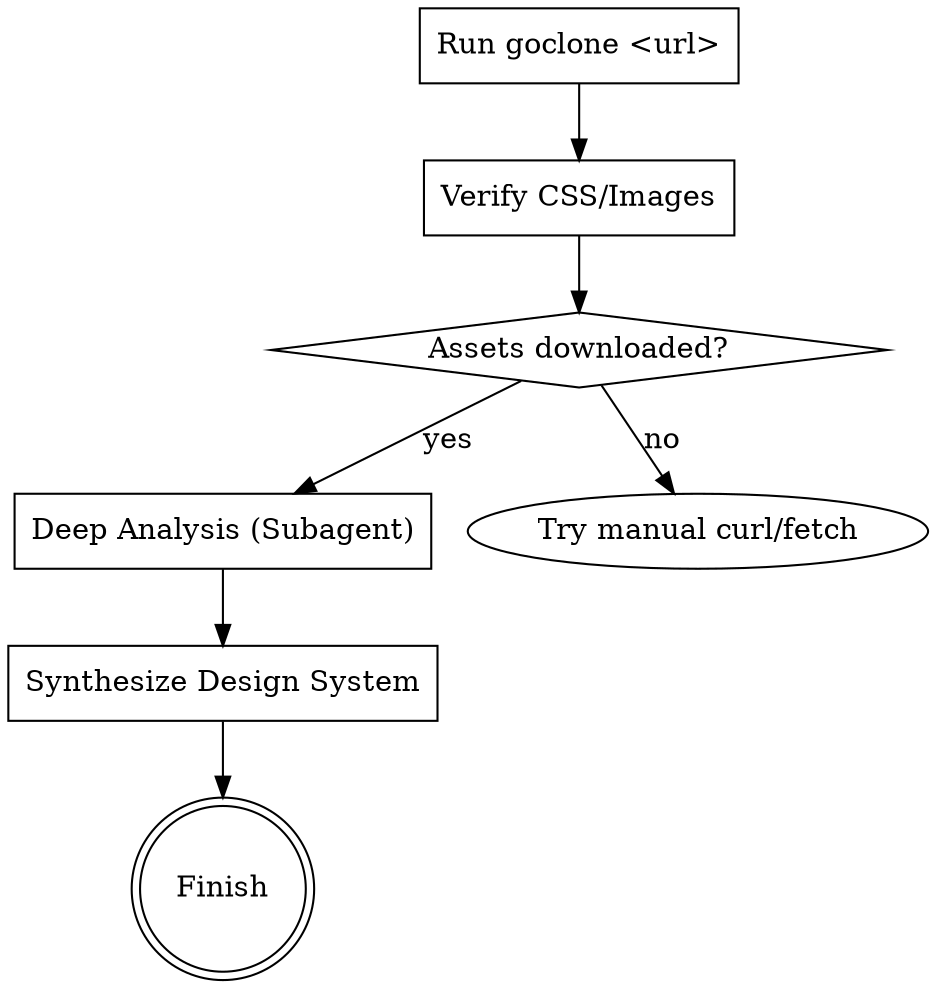

# Cloning Website Designs

## Overview
This skill provides a systematic approach to "mirroring" a website using `goclone` and then performing a deep analysis of the cloned assets to extract a reusable design system.

## When to Use
- You need to study a reference site's design tokens (colors, typography, spacing).
- You want to identify UI patterns and components (Buttons, Navbars, Cards) from a live example.
- You need local access to CSS, JS, and Image assets for prototyping or reference.

## Workflow



## Implementation

### 1. Execute the Clone
Run the command in the workspace root.
```bash
goclone https://example.com
```

### 2. Verification Checklist
- [ ] Directory `example.com/` exists.
- [ ] `example.com/css/` contains `.css` files (check for variables like `--color-*`).
- [ ] `example.com/index.html` loads correctly.

### 3. Extraction Prompt for Subagents
Delegate the heavy lifting to a `codebase_investigator`:
> "Analyze the cloned files in example.com/. Extract design tokens: Colors (hex/rgb), Typography (families, scales), Spacing, and Radii. Map recurring HTML structures to components like Buttons, Cards, and Navbars. Provide a structured Markdown report."

## Common Mistakes
- **CDN Blocks:** Some sites block `goclone`. If `css/` is empty, check for absolute URLs in the HTML and fetch them manually.
- **Minified CSS:** Compiled CSS can be hard to read. Look for CSS variables (`--variable-name`) which are often preserved.
- **Dynamic Content:** `goclone` captures the static state. JS-rendered components might require checking the HTML for data-attributes (e.g., `data-melt-dropdown`).

## Rationalization Table
| Excuse | Reality |
|--------|---------|
| "I can see the colors in the browser" | Manual picking is slow and misses the semantic system (tokens). |
| "Goclone finished, so I'm done" | The goal is the *design system*, not just the files. |
| "The CSS is too minified" | Modern sites use CSS variables that provide the token map even when minified. |
